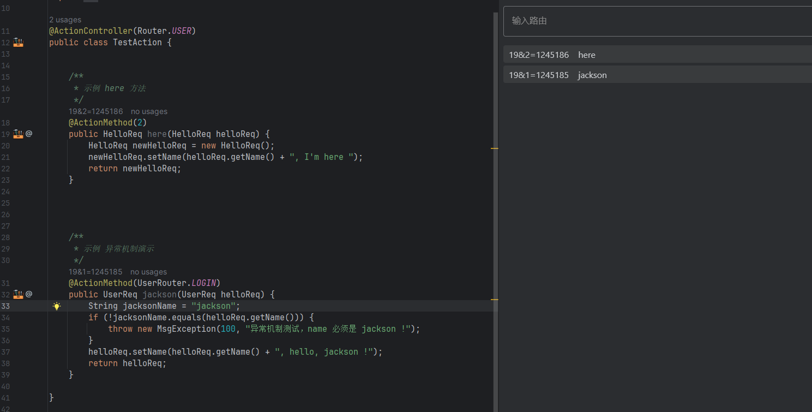
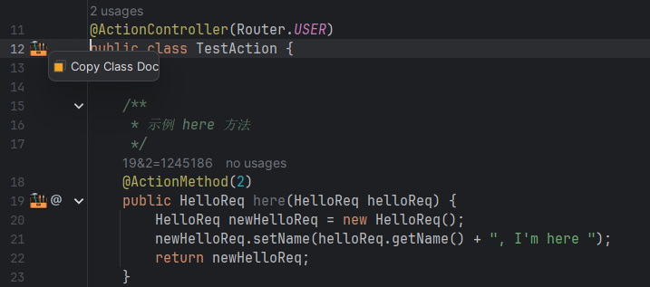

# IoGameExample

## 介绍

- QQ群: `289132257`
- IoGame插件是什么？
- 一个基于IDEA平台的插件，对IoGame框架进行增强功能开发。
- 如路由导航,路由预览,在项目越来越大时往往找路由需要花费一些时间。此插件可以快速定位到目标方法上。
- 文档导出功能,当您与他人合作时。有时需要编写文档和参数之类。此插件提供可导出文档功能。
- 对全栈开发者,此插件提供客户端请求代码模板。路由类转成对应语言类路由类,可减少大量编写模板时间(dev)。
- 对IoGame进行json模式下的调试(dev)
- 反馈 [Issues](https://github.com/licheng1013/io-game-example/issues)

## 安装插件

- 注意: 如果搜索不到插件请检查是否是最新版IDEA
- IoGame插件 [IoGame](https://plugins.jetbrains.com/plugin/20526-iogame)

## 插件支持功能

- 版本表示在什么时候加入的功能
- y/n 表示是否支持 y 支持 n 暂不支持

| 功能              | 描述                             | y/n    | 版本       |
|-----------------|--------------------------------|--------|----------|
| 路由导航            | 通过界面来定位路由位置                    | y      |          |
| 路由预览            | 在方法上直接显示计算后的路由                 | y      |          |
| 入出参数预览          | 在方法上点击按钮后无需跳转即可预览              | n      |          |
| Proto导出         | 导出某个@ProtobufClass为Proto文件     | y      |          |
| 类复制为Proto       | 要求@ProtobufClass标记的类           | y      |          |
| 文档导出            | 导出所有文档或类文档或单个方法文档              | y      |          |
| Action调试        | 对json模式Action调试                | y(测试中) |          |
| 客户端代码请求模板       | 通过方法导航图标创建客户端请求代码              | y      | 2023.9.3 |
| 路由类转换C#代码       | 把当前目录下有路由类转换为对应的C#类            | y      |          |
| 路由类转换TS代码       | 把当前目录下有路由类转换为对应的TS类            | y      |          |
| 自动把路由类为C#代码     | 自动转换为C#代码需要指定扫描目录              | n      |          |
| 自动把路由类为TS代码     | 自动转换为TS代码需要指定扫描目录              | n      |          |
| 自动把实体转换为Proto文件 | 自动转换@ProtobufClass标记的类为Proto文件 | y      | 2023.9.3 |


### 路由导航与路由预览
- 通过界面来定位路由位置
- 

### 文档&Proto导出,C#&TS代码转换
- 

### 当个方法或类文档导出
- 
- 


### 客户端请求代码模板

- 

- 模板文件存在于项目io-game/code.txt 可由此进行定制
- 示例

```text
clientChannel.request({
    cmdMerge: #{cmdMerge},
    supplierRequestData: () => {
        return new #{paramType}()
    },
    callback: result => {
        let userInfo = result.getValue(new #{returnType}());
    }
});
```

- 转换后

```ts
clientChannel.request({
    cmdMerge: 1245186,
    supplierRequestData: () => {
        return new HelloReq()
    },
    callback: result => {
        let userInfo = result.getValue(new HelloReq());
    }
});
```

- 预定义变量

| 变量名           | 变量描述               |
|---------------|--------------------|
| #{cmdMerge}   | 计算后的值              |
| #{paramType}  | 方法最后一个参数类型,没有则为 "" |
| #{returnType} | 返回类型,没有则为 ""       |
| #{cmd}        | 解析后cmd数字           |
| #{subCmd}     | 解析后subCmd数字        |
| #{cmdName}    | 解析前cmd             |
| #{subCmdName} | 解析前cmdSub          |

- 注意:
- 解析后是经过处理的值，假设引用了其他类变量的值 如 @ActionMethod(UserRouter.LOGIN) 会找 UserRouter.LOGIN 的实际值
- 解析前是没有处理的值，如 @ActionMethod(UserRouter.LOGIN) 则 UserRouter.LOGIN

### Proto自动转换
- 

## 反馈

- [Issues](https://github.com/licheng1013/io-game-example/issues)

